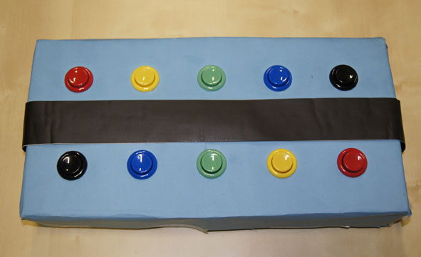

Button box tools
==============

Code to create a simple button box using an arduino board and handling events in python.

The documentation is minimal, code should speak for itself.

Load the arduino/pooling/pooling.ino in the arduino board of your choice. This code streams input states to the serial port.
Buttons should be from pin 3 to 12. Adapt the code for more or less button.

Plug the board to your computer via USB. Use the code in python/button.py to listen to the serial port.
There is several classes:

- Button() is the class that listen to the serail port.
- ButtonEvent() call a callback function each time a button is pressed or released.
- ButtonEventRecorder() and ButtonReplay() respectively record and replay button events in/from a file, so you can debug your code without the box or replay experiment easily.
- ButtonClient() and ButtonServer() can be used to stream button values over TCP, useful to setup interactive experiments from different rooms.
- ButtonPersistOn() is meant to replace a Button() class by simulating a longer pressed time of each button. This is useful when displaying events, sometimes they are too fast for the eyes.

There is a small example at the end of the python/button.py module.

